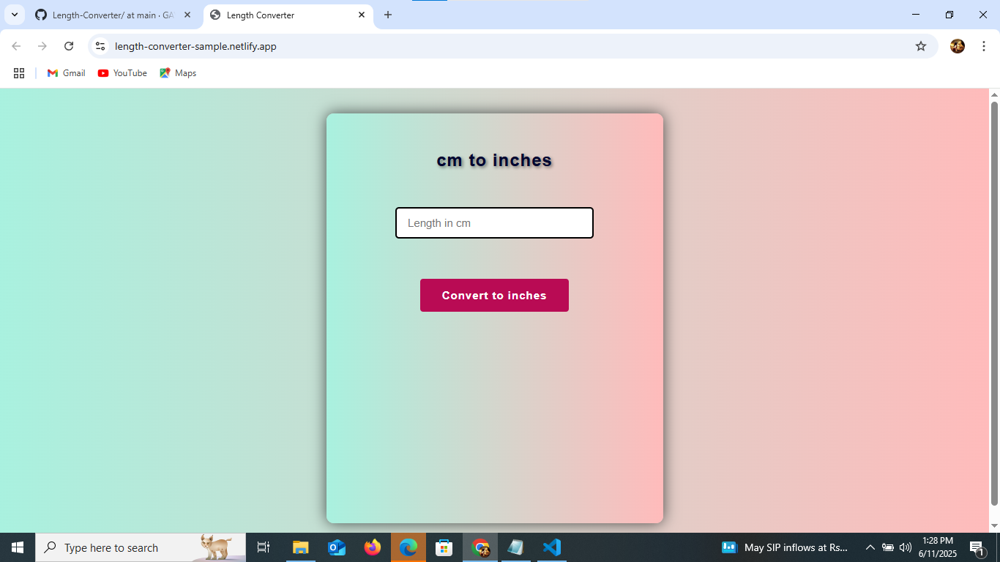

# Length Converter – CM to Inches

A simple web-based **Length Converter** that converts centimeters (cm) to inches, built using **HTML**, **CSS**, and **JavaScript**. This tool is ideal for students, designers, or anyone needing quick and accurate unit conversion.

## Demo

[Live Demo](https://length-converter-sample.netlify.app/)  

## Developed By
**Gayathri G**  
GitHub: [GAYATHRI1006](https://github.com/GAYATHRI1006)

## Screenshot

  
  

## Features

- Converts centimeters to inches instantly
- Clean and minimal design
- Input validation for empty or invalid input
- Rounds result to three decimal places

## Conversion Formula

1 inch = 2.54 cm
inches = cm / 2.54

## How to Use

1. Open the `index.html` file in a web browser.
2. Enter a value in centimeters.
3. Click on **Convert to inches**.
4. The result will be displayed in inches.

## Input Validation

- If the input field is empty or contains non-numeric text:  
  `Please enter a valid input`

## Technologies Used

- **HTML** – Structure
- **CSS** – Styling (linked via `style.css`)
- **JavaScript** – Conversion logic and validation

